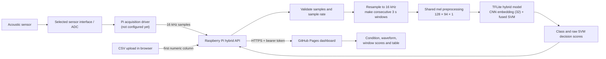

# IIoT Motor Acoustic Monitor

GitHub Pages hosts the browser dashboard. The Raspberry Pi hosts a protected Python API that loads the integrated multiclass CNN + SVM model and performs inference. Sensor acquisition is a separate Pi-side step: the sensor interface/ADC has not yet been selected, so this repository does not claim to capture live hardware data.

## How the system works



For remote GitHub Pages access, the browser must reach the Pi API over **HTTPS**. A common setup is a TLS reverse proxy on the Pi forwarding to the API bound to `127.0.0.1`. The API requires a bearer token and only allows configured browser origins.

## Repository layout

```text
.github/workflows/deploy-pages.yml  Deploys the static site to GitHub Pages
web/
  index.html                        Dashboard page
  styles.css                        Responsive visual design
  app.js                            API connection, CSV upload, plots and results
raspberry_pi/
  hybrid_api.py                     Authenticated Pi HTTP API
hybrid_inference.py                 TFLite model loading and shared window inference
acoustic_preprocessing.py           Shared signal and spectrogram preprocessing
acoustic_hybrid_training.py         Integrated CNN + SVM training pipeline
pi_hybrid_predict.py                Command-line hybrid inference
models/hybrid_multiclass/
  hybrid_model.tflite               Raspberry Pi inference model
  hybrid_model.h5                   Verified Keras fallback
  model_metadata.json               Model inputs, classes and held-out metrics
requirements-pi-hybrid.txt          Pi-side Python package list
tests/test_hybrid_api.py            Pi API contract tests
```

The older Streamlit interface has been retired. The existing training scripts and tracked historical artifacts remain separate from the Pages UI and Pi API.

## 1. Deploy the dashboard to GitHub Pages

The repository workflow deploys `web/` after changes are pushed to the `main` branch. In the repository settings, set **Pages → Build and deployment → Source** to **GitHub Actions**. The site URL will normally be:

`https://uknowufos-28.github.io/iiot-acoustic-dashboard/`

No model, Pi address, or secret is compiled into the Pages files. The operator enters the Pi API HTTPS URL and token in the page when connecting.

For local browser development, serve the static files from the repository root:

```bash
python -m http.server 8000 --directory web
```

Open `http://localhost:8000`. The local origin is included in the API's default development CORS list.

## 2. Install the model service on Raspberry Pi

Copy or clone this repository to the Pi, then create its Python environment:

```bash
python3 -m venv .venv
source .venv/bin/activate
python -m pip install --upgrade pip
python -m pip install -r requirements-pi-hybrid.txt
```

Install a `tflite-runtime` wheel compatible with the Pi's operating system, architecture and Python version. If a compatible Lite runtime is unavailable, install `tensorflow-cpu` as a larger fallback. The model expects a 16 kHz mono signal and one 3-second window at a time.

Create a strong token and set the exact browser origins. Keep this token out of source files and GitHub:

```bash
export IIOT_API_TOKEN="$(python -c 'import secrets; print(secrets.token_urlsafe(32))')"
export IIOT_ALLOWED_ORIGINS="https://uknowufos-28.github.io"
printf '%s\n' "$IIOT_API_TOKEN"
```

Copy the printed token from the Pi terminal into the dashboard's password field; do not put it in the website files or commit it.

Run the API bound to loopback when a local HTTPS reverse proxy will forward traffic to it:

```bash
python -m raspberry_pi.hybrid_api --host 127.0.0.1 --port 8765
```

For direct network binding, the service requires TLS certificate and key files:

```bash
python -m raspberry_pi.hybrid_api --host 0.0.0.0 --port 8765 \
  --tls-cert /path/to/fullchain.pem --tls-key /path/to/privkey.pem
```

Do not expose an unencrypted API or its bearer token to the public internet. If using a reverse proxy, configure it for HTTPS and forward to `127.0.0.1:8765`. In the browser, enter that proxy's `https://` address and the token set in the Pi service environment.

For example, a Caddy site entry for a DNS name pointed at the Pi can forward HTTPS traffic to the loopback-only API:

```text
pi-api.example.com {
    reverse_proxy 127.0.0.1:8765
}
```

## 3. Test with a CSV recording

Connect to the Pi API in the dashboard, enter the recording's actual sample rate, choose a headerless numeric CSV and select **Process on Raspberry Pi**. The API uses the first CSV column, resamples it to 16 kHz and returns one result per complete 3-second window. Any final segment shorter than 3 seconds is not analyzed.

The dashboard displays the newest predicted class, a signal plot, a chronological score chart and a window-by-window table. The returned SVM scores are raw decision values—not probabilities or calibrated confidence. A `Normal` result means only that `Normal` had the highest score for that window; it does not guarantee that the motor is fault-free.

The API also exposes:

| Endpoint | Purpose |
|---|---|
| `GET /api/health` | Authenticated model-service health check |
| `POST /api/predict` | Infer on numeric samples and update the latest result |
| `GET /api/latest` | Return the most recently submitted result for live dashboard polling |

`POST /api/predict` accepts JSON such as:

```json
{
  "sample_rate_hz": 16000,
  "samples": [0.12, -0.08, 0.04]
}
```

The sample array must contain finite numeric values and is size-limited. The API retains only the latest result in memory; it does not store uploaded recordings.

## 4. Connect a real sensor (hardware still required)

The Raspberry Pi does not have a general-purpose analog input. Choose a sensor and a compatible USB audio interface, I²S ADC/microphone, or external ADC before attempting live capture. Confirm that its driver produces the intended signal channel at the verified 16 kHz source rate.

Then implement and validate a Pi acquisition driver that:

1. Reads samples from the selected device without silently dropping data.
2. Sends complete sample windows to `POST /api/predict` (3 seconds at 16 kHz is 48,000 samples).
3. Reports device loss, overflow and sample-rate errors rather than fabricating values.
4. Runs alongside the API; the dashboard polls `GET /api/latest` for new results.

No hardware driver, physical sensor connection, Raspberry Pi test, or Pi latency measurement is included yet. Until those steps are complete, use CSV playback and treat results as experimental decision support—not a safety alarm.

## Model results and limitations

The integrated hybrid was evaluated on 1,120 held-out windows from disjoint recording-level splits. Its accuracy was **51.25%**. Recall was **12.0%** for normal, **49.9%** for overhang and **56.0%** for underhang. The low held-out performance means fault misses and false alarms are possible. Full metrics and the confusion matrix are in `models/hybrid_multiclass/model_metadata.json`.

## Validation commands

Run the Raspberry Pi API contract tests and syntax checks from the repository root:

```bash
python -m unittest discover -s tests -v
python -m py_compile hybrid_inference.py raspberry_pi/hybrid_api.py
```
