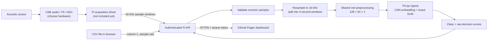

# Raspberry Pi Hybrid Model Setup Guide

This guide connects the deployed GitHub Pages dashboard to the integrated CNN + SVM model running on a Raspberry Pi. It also explains what remains before a physical sensor can provide live samples.

> **Scope:** The Pi service and CSV-to-model path are implemented. This project has not yet been tested on a physical Pi or sensor. Choose the sensor interface/ADC before implementing live acquisition. The model is experimental and must not be used as a safety interlock.

## System flow



The public dashboard runs in the operator's browser. It does **not** run the model. The Pi API loads `models/hybrid_multiclass/hybrid_model.tflite`, performs inference, and returns the scores. GitHub Pages cannot access hardware connected to the Pi.

## Before you begin

You need:

- A Raspberry Pi with Raspberry Pi OS 64-bit, network access, and a power supply.
- A computer/browser that can open the dashboard: <https://uknowufos-28.github.io/iiot-acoustic-dashboard/>.
- A way to log into the Pi (local keyboard/monitor or SSH).
- A domain name or another HTTPS endpoint that the browser can securely reach for the Pi API. A GitHub Pages site is HTTPS, so browsers block ordinary unencrypted HTTP to a remote Pi.
- Later, a compatible sensor and acquisition interface. The Pi has no general-purpose analog input. **USB audio, I²S ADC, and external ADC are different hardware/software routes; select one before following the live-sensor section.**

These instructions use a 64-bit Raspberry Pi OS shell and the repository's current file names. Package wheel availability depends on the Pi model, operating-system image, CPU architecture, and Python version.

## Step 1 — Check the Raspberry Pi

Open a terminal on the Pi, or connect to it with SSH. Check its architecture, Python version, and available storage:

```bash
uname -m
python3 --version
df -h /
```

For the prebuilt TensorFlow Lite runtime, `uname -m` should normally print `aarch64`. Do not assume a Python package wheel exists for every OS/Python combination. If `tflite-runtime` cannot be installed for this exact Pi image, use a compatible runtime wheel or the larger `tensorflow-cpu` fallback described below.

## Step 2 — Get the project files onto the Pi

Install Git if needed, clone the repository, and enter its directory:

```bash
sudo apt update
sudo apt install -y git python3-venv python3-pip
git clone https://github.com/uknowufos-28/iiot-acoustic-dashboard.git
cd iiot-acoustic-dashboard
```

Confirm the model and API files were downloaded:

```bash
ls -lh models/hybrid_multiclass/
test -f models/hybrid_multiclass/hybrid_model.tflite && echo "TFLite model found"
test -f raspberry_pi/hybrid_api.py && echo "Pi API found"
```

You should see `hybrid_model.tflite`, `hybrid_model.h5`, and `model_metadata.json`. The Raspberry Pi API defaults to the TFLite file.

Python code is grouped by purpose: shared inference/preprocessing in `acoustic_model/`, the API and optional command-line predictors in `raspberry_pi/`, and training scripts in `training/`. Run commands from the repository root.

## Step 3 — Create an isolated Python environment

From the repository directory:

```bash
python3 -m venv .venv
source .venv/bin/activate
python -m pip install --upgrade pip
python -m pip install -r requirements-pi-hybrid.txt
```

Install the TensorFlow Lite interpreter and verify it:

```bash
python -c "from tflite_runtime.interpreter import Interpreter; print('tflite-runtime ready')"
```

If pip reports that there is no compatible `tflite-runtime` distribution, **do not install a random wheel for another Python or CPU architecture**. Find a wheel matching the output of `uname -m` and `python3 --version`, or use the TensorFlow CPU fallback:

```bash
python -m pip install tensorflow-cpu
python -c "import tensorflow as tf; print(tf.__version__); print(tf.lite.Interpreter)"
```

The API uses TensorFlow Lite either through `tflite-runtime` or `tensorflow-cpu`. Keep installing packages inside `.venv`.

## Step 4 — Create the API token and permitted website origin

Generate a random token in the Pi terminal and export it into the current shell:

```bash
export IIOT_API_TOKEN="$(python -c 'import secrets; print(secrets.token_urlsafe(32))')"
export IIOT_ALLOWED_ORIGINS="https://uknowufos-28.github.io"
printf '%s\n' "$IIOT_API_TOKEN"
```

Copy the printed token into a password manager or secure note. Enter the same token into the dashboard when prompted. Do not put the token in `web/app.js`, the repository, a public issue, or a screenshot. The dashboard holds it in browser memory for the current page session.

The API requires a bearer token of at least 32 ASCII characters. It also limits request size, sample rate, and duration. Do not expose its unencrypted HTTP port to the internet.

## Step 5 — Make the Pi API reachable over HTTPS

The browser page is hosted on HTTPS; browser security rules require the remote Pi API to use HTTPS too. The recommended pattern is:

```text
Browser → HTTPS domain/reverse proxy → Pi API bound to 127.0.0.1:8765
```

One common reverse proxy is Caddy. You need a DNS name pointing to your network, a route for HTTPS traffic to the Pi, and firewall/router settings that permit the HTTPS proxy to receive traffic. Install Caddy using its official instructions for the exact Raspberry Pi OS release, then configure a site entry such as:

```text
pi-api.example.com {
    reverse_proxy 127.0.0.1:8765
}
```

Replace `pi-api.example.com` with your real DNS name. Configure the router/firewall and DNS as appropriate for your network and Caddy's certificate validation. Caddy can then serve HTTPS and forward requests locally. Do **not** forward public router traffic directly to port 8765.

Alternatively, the API itself can serve TLS when given a certificate and private key. Those files must be valid for the domain/IP entered in the browser:

```bash
python -m raspberry_pi.hybrid_api \
  --host 0.0.0.0 --port 8765 \
  --tls-cert /path/to/fullchain.pem \
  --tls-key /path/to/privkey.pem
```

Never use `--host 0.0.0.0` without TLS. For a reverse-proxy setup, keep the API bound to loopback (`127.0.0.1`) instead.

## Step 6 — Start the API and check it locally

In a Pi terminal, from the repository root:

```bash
source .venv/bin/activate
export IIOT_API_TOKEN="paste-your-generated-token-here"
export IIOT_ALLOWED_ORIGINS="https://uknowufos-28.github.io"
python -m raspberry_pi.hybrid_api --host 127.0.0.1 --port 8765
```

Leave this terminal open for now. Open a second terminal on the Pi and set the **same** token:

```bash
export IIOT_API_TOKEN="paste-your-generated-token-here"
curl -i \
  -H "Authorization: Bearer $IIOT_API_TOKEN" \
  http://127.0.0.1:8765/api/health
```

Expected JSON:

```json
{"status":"ok","model":"hybrid_multiclass"}
```

An unauthenticated request should return HTTP 401. The API has three endpoints:

| Method and path | Purpose |
|---|---|
| `GET /api/health` | Authenticated model-service health check |
| `POST /api/predict` | Run inference on numeric sample values |
| `GET /api/latest` | Fetch the most recently processed windows |

## Step 7 — Connect the GitHub Pages dashboard

On a computer or phone that can reach the Pi's HTTPS endpoint:

1. Open <https://uknowufos-28.github.io/iiot-acoustic-dashboard/>.
2. In **Pi API HTTPS address**, enter your externally reachable HTTPS address, for example `https://pi-api.example.com`. Do not enter the example literally.
3. In **API bearer token**, enter the token generated on the Pi.
4. Select **Connect to Raspberry Pi**. The page shows “Pi API connected” if `/api/health` succeeds.
5. If connection fails, check TLS validity, the browser origin setting, DNS/network access, and the Pi service log.

Do not enter the Pi's private `http://192.168...` address on the HTTPS GitHub Pages site: browsers will block this insecure cross-origin request. For a local-only dashboard test, serve `web/` on `http://localhost:8000`; that local origin is included in the API's default CORS origins.

## Step 8 — Test the full model with a CSV

Use a headerless numeric CSV where the first column is the sensor channel. This project uses column 0 and the known source rate is 16 kHz:

1. In the dashboard, enter the recording's **actual** sample rate (16,000 Hz if recorded at 16 kHz).
2. Choose the CSV file. The browser sends its first column to the Pi.
3. Select **Process on Raspberry Pi**.
4. Review the predicted class, signal waveform, per-window score chart, and results table.

The model resamples to 16 kHz and analyzes consecutive non-overlapping 3-second windows. One window contains 48,000 samples at 16 kHz. A final partial segment shorter than 3 seconds is omitted; a recording shorter than 3 seconds is padded by the shared preprocessing.

The SVM values shown are **raw decision scores, not probabilities or calibrated confidence**. The largest class score determines the displayed class. A `Normal` result does not prove that the motor is fault-free.

## Step 9 — Keep the Pi service running after logout/reboot

First verify that the foreground API starts and responds correctly. Then create a root-owned environment file; it contains the secret, so restrict access:

```bash
sudo install -m 600 -o root -g root /dev/null /etc/iiot-hybrid-api.env
sudo nano /etc/iiot-hybrid-api.env
```

Add these lines, replacing the token with the actual generated secret:

```text
IIOT_API_TOKEN=replace-with-the-generated-secret
IIOT_ALLOWED_ORIGINS=https://uknowufos-28.github.io
```

Create `/etc/systemd/system/iiot-hybrid-api.service`:

```ini
[Unit]
Description=IIoT hybrid acoustic inference API
After=network-online.target
Wants=network-online.target

[Service]
Type=simple
User=pi
Group=pi
WorkingDirectory=/home/pi/iiot-acoustic-dashboard
EnvironmentFile=/etc/iiot-hybrid-api.env
ExecStart=/home/pi/iiot-acoustic-dashboard/.venv/bin/python -m raspberry_pi.hybrid_api --host 127.0.0.1 --port 8765
Restart=on-failure
RestartSec=5
NoNewPrivileges=true
PrivateTmp=true

[Install]
WantedBy=multi-user.target
```

Change `/home/pi/iiot-acoustic-dashboard` and the service account if your checkout is elsewhere. The systemd manager reads the root-owned environment file before starting the service as `pi`.

Enable and inspect it:

```bash
sudo systemctl daemon-reload
sudo systemctl enable --now iiot-hybrid-api
sudo systemctl status iiot-hybrid-api
sudo journalctl -u iiot-hybrid-api -n 50 --no-pager
```

If you update the code or environment file, restart the service:

```bash
sudo systemctl restart iiot-hybrid-api
```

## Step 10 — Select and connect a real sensor (not yet implemented)

Do this only after the CSV/API path works. Identify the sensor's electrical output and choose a compatible Pi input device:

- **USB audio interface:** suitable when the sensor and interface provide a supported analog audio signal. Check input range, bias/power, connector, and Linux capture-device support.
- **I²S microphone or ADC:** requires a compatible Pi model, wiring, enabled I²S device-tree/overlay, correct voltage levels, and a compatible Linux driver.
- **External ADC over SPI:** requires an ADC compatible with the sensor's output range and sampling requirements, correct SPI wiring/configuration, and a working driver/library.

Do not connect an unknown analog output directly to GPIO. Pi GPIO is not a general-purpose analog input. Check the sensor/interface datasheets and electrical limits before wiring; use the manufacturer's documented excitation, conditioning, grounding, and isolation.

The acquisition driver is not in this repository. After choosing hardware, implement it so it:

1. Reads the correct sensor channel at a verified 16,000 samples/second, without silent sample drops.
2. Checks for clipping, device loss, buffer overflow, invalid samples, and timing drift.
3. Buffers exactly 48,000 mono samples (3 seconds) for each inference request.
4. Sends those values to `POST /api/predict` on the Pi API, using `http://127.0.0.1:8765` from a driver running locally on the Pi and the same bearer token. Local loopback HTTP is not exposed outside the Pi.
5. Repeats for each new window and logs acquisition errors.
6. Lets the dashboard's `/api/latest` polling display the newest returned prediction.

Once the interface is selected, the service/API contract test should use **real device samples** and confirm the sample rate, channel mapping, amplitude range and dropped-sample behavior. Do not assume a CSV first-column mapping automatically identifies the corresponding live-device channel.

## Troubleshooting

| Symptom | Checks |
|---|---|
| `tflite-runtime` has no matching distribution | Check `uname -m` and Python version; find a compatible wheel or install `tensorflow-cpu` in `.venv`. |
| API fails to load the model | Run from the cloned repo with `.venv` active; confirm `models/hybrid_multiclass/hybrid_model.tflite` exists. Review `journalctl -u iiot-hybrid-api`. |
| HTTP 401 | Ensure the browser and API use the same generated token, with no extra spaces. |
| CORS/origin error | Set `IIOT_ALLOWED_ORIGINS` to the exact origin `https://uknowufos-28.github.io` and restart the API. No trailing slash is needed. |
| Browser reports mixed content or TLS error | Use a trusted, valid HTTPS address for the Pi API. Do not use a remote plain-HTTP address from the HTTPS dashboard. |
| API works locally but browser cannot reach it | Check DNS, reverse-proxy status, firewall/router HTTPS access, and whether the browser device can reach the public endpoint. |
| Predictions look implausible | Check the actual recording sample rate, numeric first-column channel, sensor gain/clipping and window length. The current model is not highly accurate. |
| `/api/latest` shows no result | Send a CSV test or run the acquisition driver; the API reports no latest value until it receives a prediction. Latest results are kept in memory only. |

## Important model limitation

The hybrid achieved 51.25% accuracy on 1,120 held-out windows. Held-out recall was 12.0% for normal, 49.9% for overhang, and 56.0% for underhang. It can miss faults and raise false alarms. Do not use this prototype to protect people or equipment; validate it on representative, independently collected sensor data and use suitable certified protection systems.

No physical Raspberry Pi latency, power, temperature, long-running reliability, or sensor performance has been measured.
